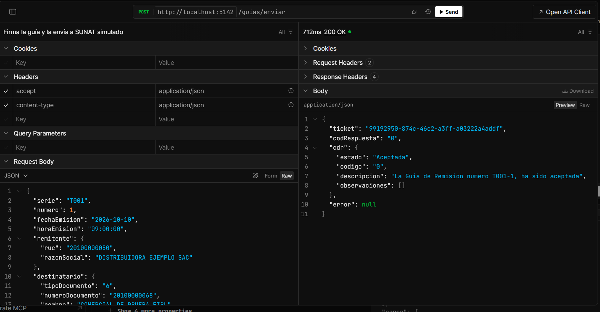

# Generador de Guía de Remisión Electrónica (GRE) — Perú

En Perú, cuando una empresa traslada mercadería (una venta, una compra, un envío entre sus locales), los bienes
deben viajar acompañados de una **Guía de Remisión Electrónica**: un documento XML firmado digitalmente que se
envía a SUNAT y que SUNAT acepta o rechaza.

Este proyecto recibe los datos de una guía, revisa las reglas de SUNAT, genera el XML en el formato oficial
(UBL 2.1), lo firma, lo empaqueta y lo "envía" a un **SUNAT simulado** que responde igual que el real.
**Nunca se conecta a SUNAT**: en producción, una guía es un documento legal.



> **Estado:** la biblioteca y la API están completas y probadas. En desarrollo: pantalla en Angular.

## Cómo ejecutarlo

Requisito: [SDK de .NET 9](https://dotnet.microsoft.com/download/dotnet/9.0). No necesita base de datos, certificado
ni credenciales.

```bash
git clone https://github.com/rmm-01/gre-xml-pe.git
cd gre-xml-pe
dotnet run --project src/GreXml.Api --launch-profile http
```

Abrir `http://localhost:5142` en el navegador: redirige a Scalar, donde se pueden probar los endpoints.
Para empezar, pedir `GET /guias/ejemplo` y enviar esa guía a `POST /guias/enviar`.

## Qué hace, paso a paso

```
datos de la guía ─► validar reglas ─► generar XML ─► firmar ─► validar XSD ─► ZIP + hash ─► SUNAT simulado ─► CDR
                    (códigos SUNAT)   (UBL 2.1)    (XMLDSig)                                 (ticket)         (aceptada,
                                                                                                               observada
                                                                                                               o rechazada)
```

| Endpoint | Qué hace |
|---|---|
| `GET /guias/ejemplo?motivo=01` | Una guía válida con datos inventados (motivos 01, 02 y 04) |
| `POST /guias/validar` | Todos los errores juntos, cada uno con su código y el campo exacto |
| `POST /guias/generar` | XML firmado, si cumple el esquema, si la firma es válida, y el ZIP listo para enviar |
| `POST /guias/enviar` | Lo anterior y el envío al SUNAT simulado: ticket y respuesta (CDR) |
| `GET /envios/{ticket}` | Consulta un envío que seguía en proceso |

Ejemplo de error de validación (`POST /guias/validar`):

```json
{
  "valida": false,
  "errores": [
    { "codigo": "GRE-201", "codigoSunat": "3343", "campo": "fechaInicioTraslado",
      "mensaje": "La fecha de inicio del traslado no puede ser anterior a la fecha de emisión." },
    { "codigo": "GRE-208", "codigoSunat": null, "campo": "bienes[1].cantidad",
      "mensaje": "La cantidad debe ser mayor que cero." }
  ]
}
```

## Motivos de traslado soportados

| Código | Motivo | Regla principal |
|---|---|---|
| 01 | Venta | El destinatario (comprador) es otra persona (SUNAT 2555) |
| 02 | Compra | El destinatario es el propio remitente y se informa al proveedor (SUNAT 2554, 4375) |
| 04 | Traslado entre establecimientos de la misma empresa | El destinatario es el remitente y la llegada es otro local |

SUNAT define 14 motivos. Agregar uno es agregar una clase con sus reglas: el XML, la firma y el envío no cambian.

## Decisiones técnicas (resumen)

- **Cada regla tiene un código propio y, si existe, el código de error de SUNAT.** Algunas reglas son propias
  (por ejemplo, peso mayor que cero) y lo indican con `codigoSunat: null`.
- **El XML se valida contra los esquemas oficiales UBL 2.1 de OASIS**, incluidos dentro de la biblioteca: la validación
  no depende de internet.
- **Firma XMLDSig "enveloped" con RSA-SHA256**, dentro de `ext:UBLExtensions`. Después de firmar, el XML no se
  reformatea: un espacio de más invalida la firma.
- **Certificado de demostración creado en memoria.** Firma de verdad, pero ninguna entidad lo respalda. El repositorio
  no guarda ningún `.pfx` ni contraseña.
- **El envío está detrás de una interfaz (`IEnvioSunat`).** El simulador revisa nombre, hash, esquema y firma, y
  responde con los códigos de SUNAT (por ejemplo, 2335 si el documento fue alterado). Una implementación real solo
  tendría que reemplazar esa pieza.
- **Seguridad al leer XML y ZIP:** sin DTD ni entidades externas (protección contra XXE) y con límite de tamaño al
  descomprimir.

## Estructura

```
src/
  GreXml.Core/   Modelo, reglas, XML, XSD, firma, empaquetado y SUNAT simulado (sin dependencia de ASP.NET)
  GreXml.Api/    Minimal API
tests/
  GreXml.Tests/  Pruebas con xUnit
```

## Pruebas

```bash
dotnet test
```

154 pruebas, sin acceso a internet: una por cada regla, el XML leído con XPath, el esquema, la firma (incluida la
detección de un dato alterado), el ciclo de envío con cada código de error y la API de punta a punta.

## Licencia

Código bajo licencia [MIT](LICENSE). Los esquemas de `src/GreXml.Core/Esquemas/` son de OASIS y conservan su propio
aviso de copyright (ver [LEEME](src/GreXml.Core/Esquemas/LEEME.md)).
